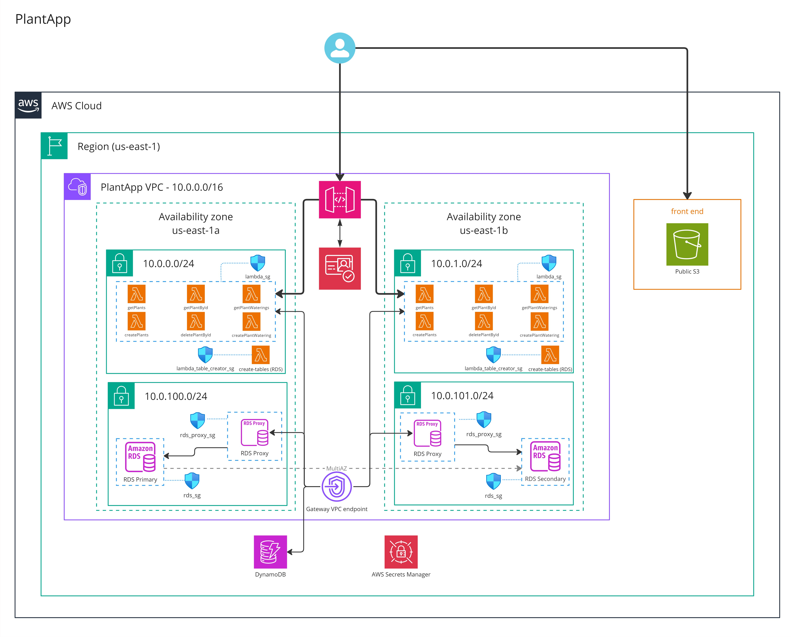

<h1 align="center" style="display: block; font-size: 2.5em; font-weight: bold; margin-block-start: 1em; margin-block-end: 1em;">

    <strong>PlantApp</strong>
</h1>

  
  
  
  
  

---

# Table of contents
- [Table of contents](#table-of-contents)
  - [About this repository](#about-this-repository)
  - [Terraform deployment](#terraform-deployment)
    - [Requirements](#requirements)
    - [Getting started](#getting-started)
    - [Meta-arguments and functions used](#meta-arguments-and-functions-used)
    - [Modules](#modules)
  - [Architecture components](#architecture-components)

## [About this repository](#about-this-repository)
- The `readme_utils` folder includes resources (e.g., images) used in the `README.md` file.
- The `frontend folder` contains a React app that will be deployed to an S3 bucket.
- The `backend` folder contains JavaScript code for deployment in multiple Lambda functions, accessible through an API Gateway.
- The `terraform` folder contains Terraform code to deploy the entire application and its [architecture](#architecture-components).

## [Terraform deployment](#terraform-deployment)
PlantApp can be fully deployed with Terraform. Terraform will create all the AWS resources necessary, and will also run scripts for building and packaging the required code before deploying it.

Due to these scripts, **the terraform deployment must be run on Linux**. This is confirmed to work on Ubuntu 22.04 LTS.

### [Requirements](#requirements)

- [Terraform](https://developer.hashicorp.com/terraform/install)

- The [AWS CLI](https://docs.aws.amazon.com/cli/latest/userguide/getting-started-install.html)

- [npm](https://docs.npmjs.com/downloading-and-installing-node-js-and-npm), and [Node 18](https://nodejs.org/en)

    - We recommend using [nvm](https://github.com/nvm-sh/nvm?tab=readme-ov-file#installing-and-updating) to install these:

    - `curl -o- https://raw.githubusercontent.com/nvm-sh/nvm/v0.40.1/install.sh | bash`

    - Once that's done, open a new terminal (existing terminals won't recognize nvm), and run `nvm install 18`

- The `zip` apt package, installable with `sudo apt install zip`

### [Getting started](#getting-started)

Once all the requirements have been installed, deploy the project by following these steps:

1. Ensure you have your AWS CLI credentials ready in `~/.aws/credentials`

    - Note: some of the scripts within terraform will invoke the AWS CLI manually

2. Fill in the terraform variables at `PlantApp/terraform/terraform.tfvars`

    - We have provided an example `terraform.tfvars-sample` file

3. Initialize and run terraform in the `terraform` directory

    - cd into the directory: `cd terraform`

    - Initialize Terraform on the directory: `terraform init`

    - Generate an execution plan and review: `terraform plan`

    - Apply changes on the infrastructure: `terraform apply`

> [!IMPORTANT]  
> The deployment of the infrastructure will take approximately 20 to 25 minutes. Once Terraform finishes deploying everything, go to the S3 service, click on the 'Properties' tab, and under the 'Static website hosting' section, click on the bucket website endpoint to access the application (e.g. http://itba-cloudcomputing-2024q1-g10-t.s3-website-us-east-1.amazonaws.com).

### [Meta-arguments and functions used](#meta-arguments-and-functions-used)
- [depends_on](https://developer.hashicorp.com/terraform/language/meta-arguments/depends_on)
- [for_each](https://developer.hashicorp.com/terraform/language/meta-arguments/for_each)
- [count](https://developer.hashicorp.com/terraform/language/meta-arguments/count)
- [lifecycle](https://developer.hashicorp.com/terraform/language/meta-arguments/lifecycle)
- [cidrsubnet](https://developer.hashicorp.com/terraform/language/functions/cidrsubnet)
- [element](https://developer.hashicorp.com/terraform/language/functions/element)
- [jsonencode](https://developer.hashicorp.com/terraform/language/functions/jsondecode)
- [plantimestamp](https://developer.hashicorp.com/terraform/language/functions/plantimestamp)

### [Modules](#modules)
The project consists of a [main.tf](terraform/main.tf) located at the root of the project, which calls several modules to deploy the infrastructure.

Only one external module was used, the [dynamoDB Table](https://registry.terraform.io/modules/terraform-aws-modules/dynamodb-table/aws/latest). The rest of the modules were made by us. Each module consists of a `main.tf`, an `outputs.tf`, a `variables.tf`, and optionally a `locals.tf`.

Brief description of each custom module:
- `vpc`: provisions the core network infrastructure for the PlantApp, defining a VPC with private subnets for Lambda and RDS instances. It creates route tables for these subnets, associates them, and sets up subnet groups for RDS and Lambda. Additionally, it configures VPC endpoints for S3 and DynamoDB to enable private access to these services without needing internet access
- `security_groups`: provisions multiple security groups within the VPC to control network traffic. It sets up egress rules for Lambda functions and a specific table creator Lambda, allowing outbound traffic. Two security groups for the database and its proxy are also defined, with ingress rules allowing secure communication over port 5432 (PostgreSQL) between the Lambdas and the database. All resources have a `create_before_destroy` lifecycle to ensure smooth updates during deployments.
- `secrets`: creates a secret in AWS Secrets Manager for securely storing RDS credentials. 
- `s3`: provisions an S3 bucket for hosting the frontend. It creates the bucket, configures it for website hosting with an `index.html` document, and allows public access to the objects within it through a bucket policy. A `null_resource` is used to build the frontend using a script that injects the necessary `API URL` and other environment variables. Following the build process, another `null_resource` uploads the built files to the S3 bucket using the AWS CLI, ensuring that the files are only uploaded after the API Gateway is established and the frontend is ready. The original plan was to use `aws_s3_object` for direct file uploads, however this was not possible because the frontend's files aren't available during terraform's planning stage, as the frontend requires variables such as the `API URL` to build.
- `rds_proxy`: establishes an AWS RDS Proxy for a PostgreSQL database. The use of RDS Proxy is essential for our Lambda functions. The proxy leverages a secret for authentication, which is linked to the RDS database credentials stored in AWS Secrets Manager.
- `rds`: provisions an AWS RDS PostgreSQL database instance, configured with specific credentials, storage, and security settings. It also includes a `null_resource` to build a Lambda function, `rds_table_creator`, which creates the tables in the db. A second `null_resource` is used to invoke the Lambda function after both the database and the function are created, ensuring that the database setup is completed as intended.
- `lambdas`: provisions the setup for multiple AWS Lambda functions related to the backend (see the architecture below). It utilizes a `null_resource` to create `zip` files for each Lambda function, compressing the necessary files from the backend directory.
- `cognito`: provisions an AWS Cognito User Pool for the app enabling user authentication and management. The user pool is set up to allow both user and admin-initiated account creation, with email as the primary username attribute. It includes an email verification process, where users receive a confirmation code for account verification.
- `api_gw`: provisions an HTTP API for the application using AWS API Gateway. It establishes CORS settings, defines routes for plant management (GET, POST, DELETE), and secures them with a JWT authorizer integrated with AWS Cognito. The API connects to Lambda functions through proxy integrations, allowing functionalities like retrieving and creating plants, as well as managing watering records. Additionally, it grants permissions for API Gateway to invoke the respective Lambda functions.

## [Architecture components](#architecture-components)

  

